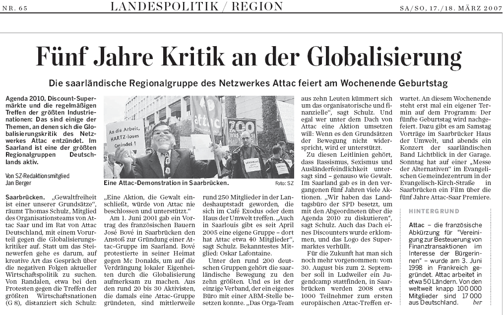

Mit über 700 Mitgliedern gehört **Attac Saar** zu den größeren Regionalgruppen des globalisierungskritischen Netzwerks, das weltweit ca. 90.000 Mitglieder (davon ca. 30.000 in Deutschland) zählt. Am 27. Oktober 2001 wurde Attac Saar gegründet, die Initialzündung hatte eine Veranstaltung der Aktion 3. Welt Saar am 1. Juni 2001 mit dem französischen Bauernführer José Bové in der Saarbrücker Johanneskirche gegeben.

Sieben Jahre später kam Bové erneut nach Saarbrücken: Vom 1. bis 6. August 2008 fand nämlich die „European Summer University“ (ESU), das erste Europatreffen von Attac, auf dem Saarbrücker Uni-Campus statt, mit 1.300 Teilnehmer\*innen aus über 40 Ländern und unzähligen Einzelveranstaltungen ein Meilenstein für das globalisierungskritische Netzwerk.

Foto: Gerhard Schaal

Attac-Saar-Gründungsmitglied Marie-Louise Innocent ist Mitglied des bundesweiten Attac-Rates. Regionalsprecher von Attac Saar ist Thomas Schulz.

Attac Saar unterhält ein Büro im Saarbrücker „Haus der Umwelt“, wo auch die Gruppentreffen stattfinden. Attac Saar ist u.a. Mitglied im Netzwerk Entwicklungspolitik (NES), im Saarland Sozialgipfel, in der Menschenrechtskoordination Kolumbien (kolko) und veranstaltet seit dem Jahr 2003 in unregelmäßigen Abständen das Filmfestival „GLOBALE“.

Der Vorstand des Deutschen Gewerkschaftsbundes im Saarland ist Mitglied bei Attac Saar, einzigartig in Deutschland.

Die Abkürzung Attac steht im Deutschen für: „Vereinigung zur Besteuerung von Finanztransaktionen zur Hilfe der Bürger“.

Rückblick auf 5 Jahre Attac 2007
